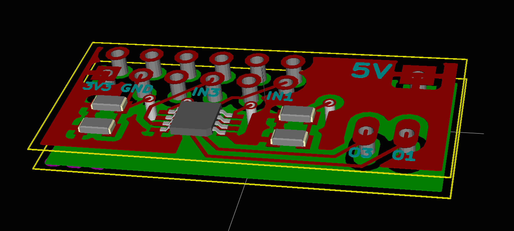

Level Shifter
=============

This level shifter board was designed in Kicad to translate between the 3.3V logic
coming out of the FPGA and the 5V logic needed by the LED string.

A 3D rendering of the PCB is shown below:

